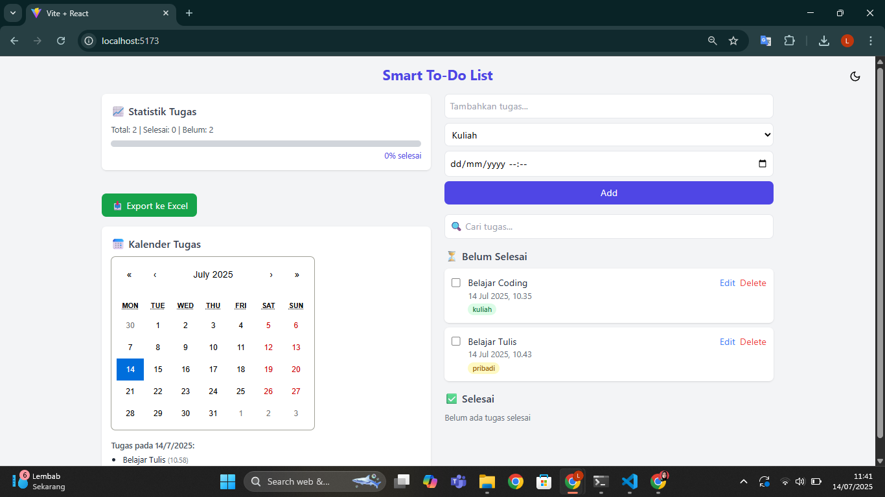
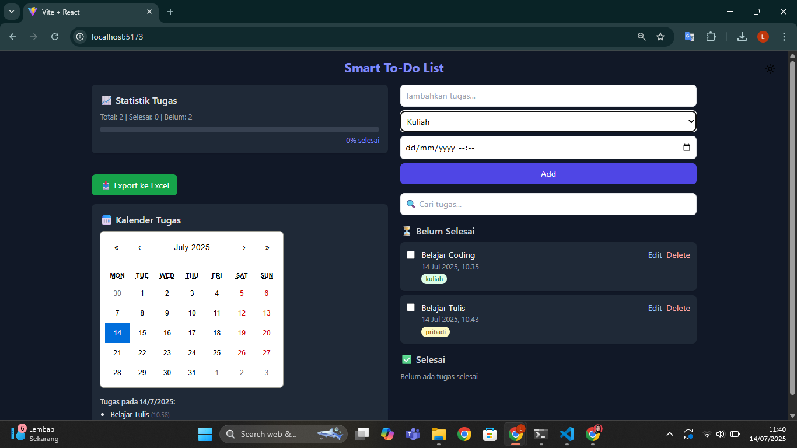

# 📋 Smart To-Do List

Smart To-Do List adalah aplikasi manajemen tugas berbasis web yang modern dan responsif. Aplikasi ini dirancang dalam rangka Capstone Project dengan bantuan AI (IBM Granite) selama proses pengembangan untuk mempercepat, mendokumentasikan, dan menyempurnakan kode.

---

## 🌟 Fitur Utama

- ✅ Tambah/Edit/Hapus Tugas
- 📂 Kategori Tugas (Kerja, Kuliah, Pribadi, Urgent)
- 🌙 Dark Mode Toggle
- 🔍 Pencarian dan Filter Tugas
- 📅 Calendar View (highlight tugas berdasarkan tanggal)
- ⏰ Reminder Otomatis via Notifikasi (berbasis deadline)
- 📊 Statistik dan Progress Bar
- 📤 Export Tugas ke Excel
- 🧠 Penyimpanan Lokal (`localStorage`)
- 📱 Tampilan Responsive & Grid Layout

---

## 🖼️ Tampilan Aplikasi

### 📱 Desktop View (Light & Dark Mode)




---

## 🚀 Teknologi yang Digunakan

| Teknologi         | Deskripsi                         |
| ----------------- | --------------------------------- |
| React.js          | Library utama untuk membangun UI  |
| Tailwind CSS      | Styling responsif dan cepat       |
| Vite              | Dev Server dan Bundler            |
| xlsx + file-saver | Export data ke file Excel (.xlsx) |
| React-Calendar    | Komponen kalender interaktif      |
| Notification API  | Notifikasi browser untuk reminder |
| localStorage      | Simpan data lokal (tanpa backend) |

---

## 📁 Struktur Folder

```bash
smart-todo-app/
├── public/
├── src/
│ ├── components/
│ │ ├── TodoItem.jsx
│ │ ├── CalendarView.jsx
│ │ ├── DarkModeToggle.jsx
│ │ ├── StatsProgress.jsx
│ │ └── ExportExcel.jsx
│ └── App.jsx
├── README.md
└── ...

---

## 🛠️ Cara Menjalankan Proyek

1. **Clone repositori ini**
   git clone https://github.com/username/smart-todo-app.git
   cd smart-todo-app
2. **Install dependencies**
   npm install
3. **Jalankan aplikasi**
   npm run dev
4. **Buka di browser**
   http://localhost:5173

---

🤖 Peran AI dalam Pengembangan
Dalam proyek ini, model AI (IBM Granite) digunakan untuk:

📁 Menyusun struktur kode dan file

⚛️ Membantu logika fungsi React & state management

---

✨ Pengembangan Selanjutnya
🔐 Autentikasi User (Firebase Auth)

☁️ Penyimpanan Data di Cloud (Firestore)

📤 Share daftar tugas via Email/WhatsApp

📱 PWA (Progressive Web App) Support

🎤 Voice Input (Tambah tugas via Speech API)

🧠 Integrasi AI (Saran otomatis prioritas tugas)

💾 Export/Import .json atau .csv

---

👩‍💻 Developer
Defilia Fatikasari
Program Studi Teknik Informatika
Capstone Project – 2025
```
